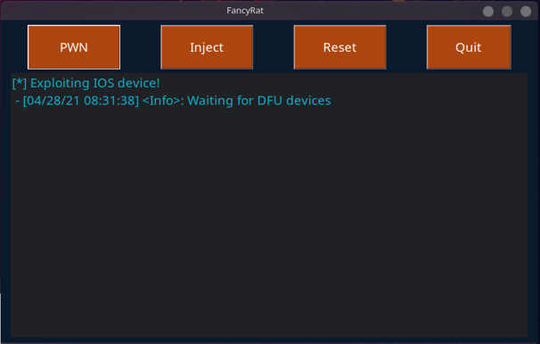

# FancyRat

FancyRat is a capstone project part of the [ISS](https://www.sait.ca/programs-and-courses/diplomas/information-systems-security) program at [SAIT](https://www.sait.ca/programs-and-courses/diplomas/information-systems-security).

## what does it do

**FancyRat** is a exploitation tool designed to exploit and install a **reverse SSH** backdoor on **Apple Iphone** devices(**4s-10**) from **IOS** versions **7-14.x** leveraging [**Checkra1n**](https://github.com/checkra1n).
Upon successfull exploitation and successful payload injection, the targeted device attemtps to conctact the C&C server via SSH. This tool was made with portability and touch screen in mind, the tool can be installed on a Raspberry Pi with a touch screen.




## Installation


```bash
pip install -r requirements.txt
```

## Usage

```bash
python3 fancyrat.py

```

## Warranty (or lack there of)
This tool is made for educational purposes. I'm not responsible for any malicious or illegal activity/behaviour that's caried out using this tool.

## License
[MIT](https://choosealicense.com/licenses/mit/)
